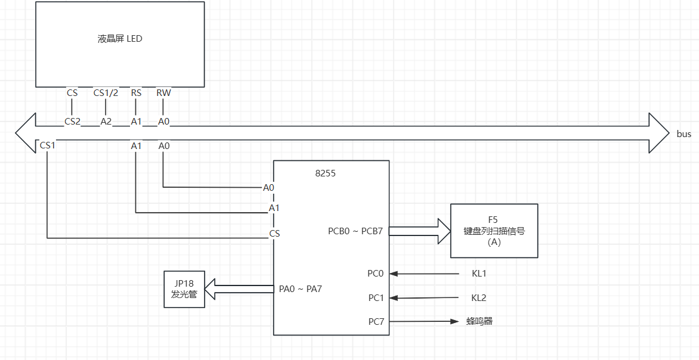
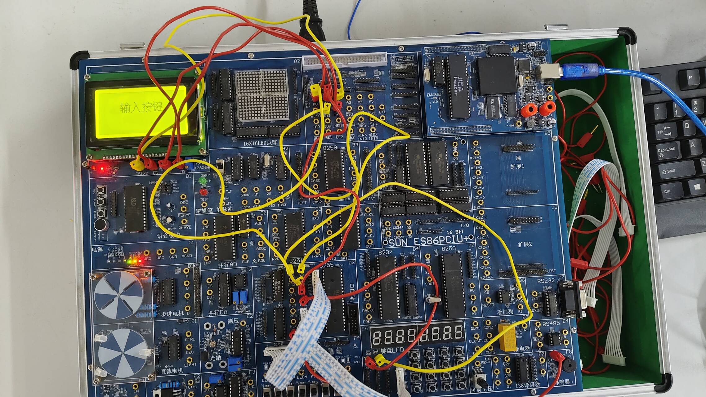
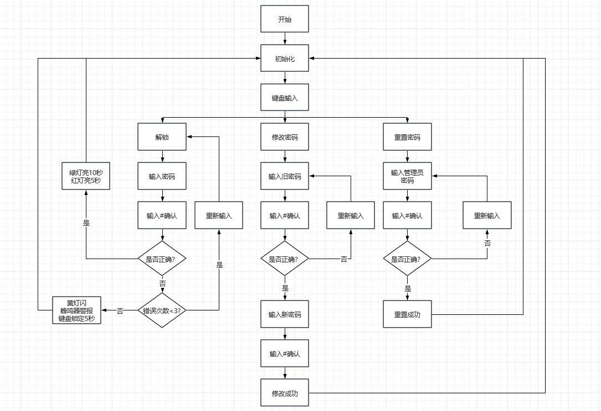

# 【西电】微机原理与系统设计课程设计 - 课题八：矩阵式键盘数字密码锁设计

forked from
https://blog.csdn.net/qq_45717425/article/details/125503197

## 键盘布局

|   7   |  8  |  9  | admin  |
| :---: | :-: | :-: | :----: |
|   4   |  5  |  6  | modify |
|   1   |  2  |  3  | delete |
| shift |  0  |  #  |        |

## 硬件布线图

## 实验箱图

## 流程图

